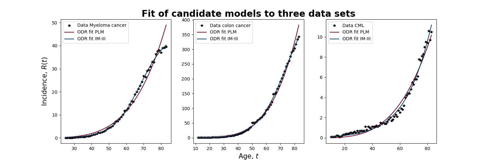
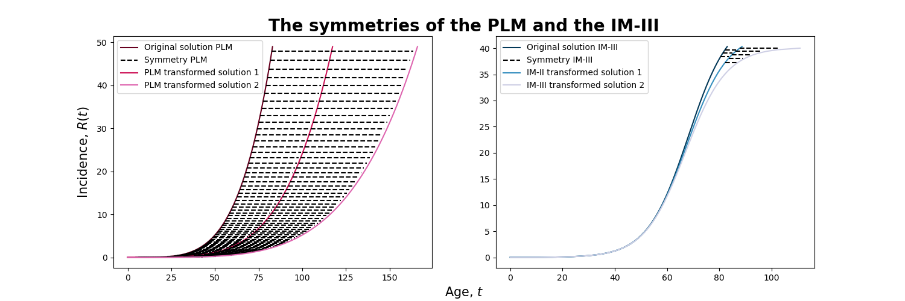
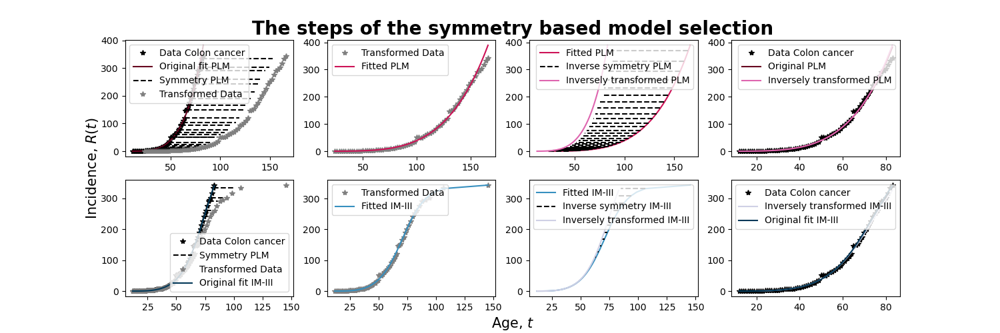
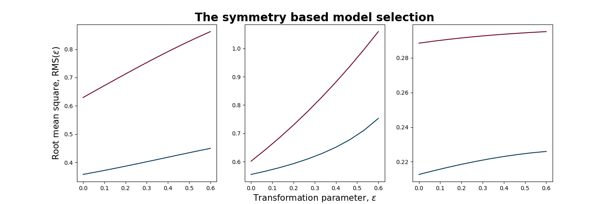

# Symmetry based model selection in the context of carcinogenesis
*Written by:* Johannes Borgqvist 
*Date:* 2022-02-17 

Welcome to the github-repositry *symmetry\_based_model\_selsection\_carcinogenesis*! This project is entirely written in Python meaning that it is open-source, and our aim is that the results in the article (**Reference to future article**) should be reproducable. Let's describe the project and all the relevant packages! 

## Description of the project
One of the greatest challenges in mathematical biology is that of model selection. Given some type of experimental data, it is often possible for the modeller to construct *multiple candidate models* that describe the same data. In the context of *mechanistic modelling* often relying on differential equations, the biological assumptions about the mechanism of the system of interest are encoded in the mathematical equations. This means that each of the candidate models encode a specific biological hypothesis, and by fitting the models to data we would validate a specific biological hypothesis. In practice, we would formulate this as a so called *model selection problem*: 

"*Pick the model that best fits the data.*" 

However, often it is not merely enough to select the model that best fits the data as multiple models might fit the same data equally well. In addition to the above criteria, there are numerous statistically based criteria for model selection which are ultimately based on the philosophical principle Occam's razor. Colloquially, we would formulate this as follows: 

"*Pick the simplest model that best fits the data.*" 

We argue that that we need a better criteria for model selection in mechanistic modelling which is based on the biological properties of the system at hand. Mathematically, we can encode such properties in so called *symmetries* which have been used with huge success in mathematical physics to encode conservation laws of various systems. Technically, symmetries are transformations that preserve solution curves of a given model. In our article, we propose a new criteria for model selection succintly formulated as follows: 

"*Select the model whose fit is invariant under transformations by its symmetries.*" 

In particular we study a concrete examples of two candidate models describing the increase in incidences of cancer due to ageing. If t is the age of the patients and R(t) is the number of incidences of cancer at age t, then we study two candidate models. The first one is called the *power law model* (PLM) given by

 

and the second candidate model is called the *immunological model* (IM-III) given by

 

When we fit these models to experimental data for three cancer types (see the figure below), we see that the IM-III has a better fit and would therefore be selected. 

To test our proposed model selection criteria, we also derive two unique symmetries of each of the two models (see the figure below). 

Using these symmetries, we then transform the data with each symmetry and then we see if the transformed solution curve still fits the data (see figure below). 

Lastly, by transforming the data with multiple transformation parameters, we see that the fit in terms of the *root mean square* (RMS) is decreased the more we transform the data (see the figure below). For a model where the fit is invariant, we would have expected the RMS-value to be constant for all transformation parameters. Thus, we conclude that neither of the two proposed models are in fact correct.

All the scripts required to reproduce these results can be found in the Code-folder. The data is provided in the Data-folder, the parameters obtained from the model-fitting are stored in the Output-folder and all the above figures are found in the Figure-folder. 

Next we will describe the Python packages that are required in order to run these scripts. 

## The required Python packages
The main Python packages are the following:

1. *scipy* version:1.6.2,
2. *numpy* version: 1.20.1,
3. *pandas* version: 1.2.4,
4. *matplotlib* version: 3.3.4,
5. *regex* version: 2021.4.4,
6. *hampel* version: 0.0.5,
7. *multiprocess* version: 0.70.11.1. 

These scripts have been developed on a computer with the OS Ubuntu 20.04. The version of Python that has been used is 3.8.8. 

## Running the scripts and more information
To generate all the results, go to the Code folder and run the script called "*symmetry\_analysis\_PLM\_vs\_IM\_III.py*". For more information on all the scripts, the data and the output go to the README-files in these respective folders. 

